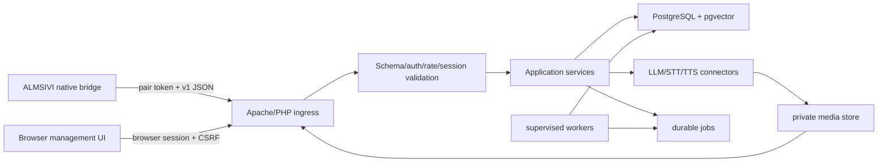

# ALMSIVIserver architecture

## System boundary

ALMSIVIserver is a single-user local-first web application in WSL2. Apache serves the browser UI and
strict game API on `127.0.0.1:8089`; PHP owns validation/application services; PostgreSQL/pgvector
owns durable state; supervised CLI workers own derived memory/profile/relationship jobs. Provider
calls are outbound server-side only.



## Target source layout

```text
public/                    # game/API front controller and browser-served files
public/ui/                 # physical PHP management pages, shared templates and vendored assets
src/Http/                  # routing/controllers/middleware
src/Application/           # turns, sessions, actions, profiles, memories
src/Domain/                # typed IDs/entities/policy
src/Infrastructure/        # DB, provider, media, queue, clock implementations
config/                    # tracked non-secret defaults/schema
database/migrations/       # ordered source-controlled migrations
database/seeds/            # test/development authored data only
workers/                   # supervised CLI entrypoints
schemas/ fixtures/         # shared protocol contract
tests/                     # unit/integration/e2e/security/migration
scripts/                   # setup/test/audit/backup/restore
storage/                   # runtime data, ignored and outside public serving
docs/evidence/
```

Use the final Synthserver's proven framework and conventions instead of forcing this illustrative
layout if its equivalent is stronger. Preserve separation and ownership, not folder spelling.

The browser surface deliberately follows the maintained Dwemer server page composition. Each
top-level PHP page loads `public/ui/ui_bootstrap.php`, includes the common head and navbar, renders
its own page family, and includes the common footer. Embedded pages use the same bootstrap and CSRF
session but omit the navbar when requested with `embed=1`. Apache aliases `/ALMSIVIserver` to the
public directory so source, configuration, storage, and secrets stay outside the served tree.

## Request lifecycle

1. Apache accepts only allowed method/path/content type/body size.
2. Game API validates pairing token with constant-time comparison, rate limit and redacted audit.
3. Strict schema, IDs, session/generation, runtime/capabilities, idempotency and content fingerprint
   are validated before application logic.
4. Source event and request status persist transactionally; no provider call occurs in a DB
   transaction.
5. Prompt service loads bounded profile/memory/relationship/world/current context with source IDs,
   records a redacted prompt trace/revision and calls the configured provider.
6. Final text, action intent and media metadata persist before ordered response events become visible.
7. Client reports delivery/action terminal result as new immutable source events.
8. Derived jobs are enqueued after commit and process idempotently.

## Persistence domains

- installations/pairing-token hash and client profiles;
- playthroughs, sessions, generations and content manifests/fingerprints;
- actor/object identities and server character profiles;
- immutable game/player/utterance/dialogue/action/result/system events;
- turns, response chunks/finals, provider attempts and redacted prompt traces;
- media metadata/ownership/hash/expiry (bytes outside DB/public root);
- relationships, memories/embeddings, world knowledge, narrator/diary and dynamic profiles;
- action definitions/policies/revisions and user settings;
- durable jobs/attempts/dead letters, worker leases, backup/restore records and audit entries.

Derived rows always reference source events and model/config revision. Deletes/retention preserve
referential integrity and user-visible provenance.

## Secrets and authentication

Server setup generates 32 random bytes and stores only an appropriate hash/fingerprint in Postgres or
secret config; native client receives the token once through a restrictive local file/import step.
Rotation permits one bounded overlap and revokes old sessions. Browser auth is separate: localhost
session cookie with HttpOnly/SameSite, CSRF on writes and no pairing token in browser storage.

Provider/database secrets come from root-readable or service-readable environment/secret config,
never tracked config, UI responses, logs, backups without encryption policy, or client payloads.

## Workers and media

Jobs use unique idempotency keys, transactional claim/lease, heartbeat, bounded exponential retry,
terminal dead letter and visible error. Workers can rebuild derived memory/profile state from source
events; they never mutate the game.

Media is written outside public root with opaque UUID, owning installation/session/turn, allowlisted
codec/MIME, declared and actual bytes/hash, expiry and access audit. Authenticated media controller
checks ownership/current session as policy requires and streams with fixed safe headers; it does not
accept a filesystem path or redirect.

## Failure and observability

Every request has correlation/request/turn/session IDs. Structured logs use stable event/error codes
and redact token, provider key, authorization, raw audio and sensitive prompt content. Metrics cover
request/provider latency, event backlog, queue pressure, media bytes, worker lag/failure, DB pool and
rate limits. UI surfaces actionable health without stack traces or secrets.

Provider/server failure returns typed status and preserves vanilla game behavior. Partial provider
output is not a completed utterance. Transaction rollback never attempts to roll back an external
provider call; reconciliation uses request/idempotency state.

## Trust boundaries

- Treat all game DTOs as untrusted, even over loopback.
- Server derives allowed profile/playthrough/action policy from authenticated installation/session,
  not client-supplied labels.
- Validate action name/tier/capability/parameters and resolved actor classes; client validates again.
- Normalize/validate any management UI URL and reject unsafe schemes/private pivot behavior according
  to provider needs; game API never accepts arbitrary URLs.
- Apply endpoint and provider rate/size/time/concurrency caps.
- Return generic errors; store detailed redacted diagnostics through the established logger.
