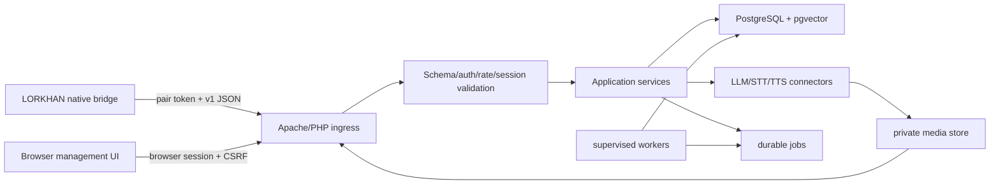

# LorkhanServer architecture

## System boundary

LorkhanServer is a single-user local-first web application in WSL2. Apache serves the browser UI and
strict game API on WSL port `8090`, exposed to Windows through the launcher's `127.0.0.1:7514` loopback proxy; PHP owns validation/application services; PostgreSQL/pgvector
owns durable state; supervised CLI workers own derived memory/profile/relationship jobs. Provider
calls are outbound server-side only.



## Target source layout

```text
public/                    # game/API front controller and browser-served files
public/ui/                 # physical PHP management pages, shared templates and vendored assets
src/Http/                  # routing/controllers/middleware
src/Application/           # turns, sessions, actions, profiles, memories
src/Domain/                # typed IDs/entities/policy
src/Infrastructure/        # DB, provider, media, queue, clock implementations
config/                    # tracked non-secret defaults/schema
database/migrations/       # ordered source-controlled migrations
database/seeds/            # test/development authored data only
workers/                   # supervised CLI entrypoints
schemas/ fixtures/         # shared protocol contract
tests/                     # unit/integration/e2e/security/migration
scripts/                   # setup/test/audit/backup/restore
storage/                   # runtime data, ignored and outside public serving
docs/evidence/
```

Use the final Synthserver's proven framework and conventions instead of forcing this illustrative
layout if its equivalent is stronger. Preserve separation and ownership, not folder spelling.

The browser surface deliberately follows the maintained Dwemer server page composition. Each
top-level PHP page loads `public/ui/ui_bootstrap.php`, includes the common head and navbar, renders
its own page family, and includes the common footer. Embedded pages use the same bootstrap and CSRF
session but omit the navbar when requested with `embed=1`. Apache aliases `/LorkhanServer` to the
public directory so source, configuration, storage, and secrets stay outside the served tree.

## Request lifecycle

1. Apache accepts only allowed method/path/content type/body size.
2. Game API validates pairing token with constant-time comparison, rate limit and redacted audit.
3. Strict schema, IDs, session/generation, runtime/capabilities, idempotency and content fingerprint
   are validated before application logic.
4. The immutable typed source event and its scoped CHIM-compatible `eventlog` projection persist
   transactionally; no provider call occurs in a DB
   transaction.
5. Prompt service loads the revisioned `prompts` selection plus bounded chronological `eventlog` and
   `speech` history, profile/memory/relationship/world/current context with source IDs,
   records a redacted prompt trace/revision and calls the configured provider.
6. Bounded display-only text deltas may become visible while the provider streams; only validated final text becomes a durable utterance.
7. Final text persists to the typed dialogue tables and scoped CHIM-compatible `speech`/`responselog`
   projections, then ordered dialogue/terminal events become visible and per-utterance TTS jobs queue.
8. TTS persists private media and emits a dialogue-correlated speech event independently; client
   delivery updates the durable speech state and action results remain immutable source events.
9. A rechat turn must advance one same-session `rechat_chains` row monotonically. It is action-free,
   depth-bounded, cancelled by new player input/failure, and advanced by the client only after final
   playback; no timer worker creates it.
10. Other derived jobs are enqueued after commit and process idempotently.

### Relationship prompt ownership

Stored relationship context belongs to the selected NPC profile within the current installation and
playthrough. A session profile is eligible only when its stable TES3 actor identity matches the
speaking target; an unbound same-name actor receives no relationship rows. An explicit actor-profile
binding remains authoritative. Prompt assembly validates relationships against that selected profile,
not the shared session profile. The existing ten-record/8 KiB prompt caps and source traces remain.
The shared ownership check decodes the stored JSON identity before comparison, so exact-identity
fallback also works for manual memories. This does not change stored relationships, static biography
text, or enable automatic evaluation.

### Memory prompt coverage

The existing privacy-filtered pool of at most 500 memories is ranked once. Prompt assembly selects
at most ten records within 16 KiB of escaped item XML. Exact full-record text already retained in
conversation history or another selected memory is omitted; lower-ranked uncovered records can
fill the remaining slots. If total prompt pressure removes history, memory is selected again without
that coverage. Per-source truncation, section caps and the final fallback are reflected in the trace.

Coverage uses actual retained text, never source-ID overlap alone. Partially overlapping summaries,
changed wording and incomplete final lines are kept. Deterministic consolidation retains its full
privacy provenance and additionally records a content hash and the source memory IDs whose complete
text survived its 16 KiB cap. Older or edited provenance grants no shortcut. No memory is deleted,
rewritten or hidden from management by prompt deduplication.

Migration 061 adds coverage omission reasons to prompt audit tables, after the exact migration 060
shared with the Tamriel Rebuilt catalog. Its rollback preserves audit rows and maps the new reasons
to older coarse omissions. Retrieval decisions store actual selected IDs/scores and bounded coverage
counts under reasons._context; source traces cover the initial top ten plus actual survivors.

## Persistence domains

- installations/pairing-token hash and client profiles;
- playthroughs, sessions, generations and content manifests/fingerprints;
- actor/object identities and server character profiles;
- immutable game/player/utterance/dialogue/action/result/system events plus scoped CHIM-compatible
  `eventlog`/`speech`/`responselog` projections;
- turns, response chunks/finals, revisioned `prompts`, provider attempts, redacted prompt traces and
  depth-bounded `rechat_chains`;
- media metadata/ownership/hash/expiry (bytes outside DB/public root);
- relationships, memories/embeddings, world knowledge, narrator/diary and dynamic profiles;
- action definitions/policies/revisions and user settings;
- durable jobs/attempts/dead letters, worker leases, backup/restore records and audit entries.

Derived rows always reference source events and model/config revision. Deletes/retention preserve
referential integrity and user-visible provenance.

## Secrets and authentication

Server setup generates 32 random bytes and stores only an appropriate hash/fingerprint in Postgres or
secret config; native client receives the token once through a restrictive local file/import step.
Rotation permits one bounded overlap and revokes old sessions. Browser auth is separate: localhost
session cookie with HttpOnly/SameSite, CSRF on writes and no pairing token in browser storage.

Provider/database secrets come from root-readable or service-readable environment/secret config,
never tracked config, UI responses, logs, backups without encryption policy, or client payloads.

## Workers and media

Jobs use unique idempotency keys, transactional claim/lease, heartbeat, bounded exponential retry,
terminal dead letter and visible error. Workers can rebuild derived memory/profile state from source
events; they never mutate the game.

Media is written outside public root with opaque UUID, owning installation/session/turn, allowlisted
codec/MIME, declared and actual bytes/hash, expiry and access audit. Authenticated media controller
checks ownership/current session as policy requires and streams with fixed safe headers; it does not
accept a filesystem path or redirect.

## Optional model memory summaries

The installation's revisioned `memory_policy` is off by default. Enabling it requires an explicit
LLM connector from the same installation. Saving the policy never calls a provider or queues past
memories. Normal four-record deterministic consolidation remains authoritative; when enabled, each
new mid/long consolidated memory queues a bounded `memory.summarize` job. The Memories page can also
request one eligible existing record. `memory.rebuild` remains a deterministic index rebuild.

Jobs freeze memory, policy and provider revisions, use the existing strict JSON text transport,
and record provider attempts. A summary is a separate UTF-8 projection (maximum 4096 bytes), keyed
by the exact memory revision; originals, search terms and source/witness provenance are unchanged.
Prompt retrieval substitutes it only while its policy remains enabled and the original revision
is current. Existing privacy checks still decide whether that memory can enter a prompt. Traces
identify the projection and its input hash; ranking remains deterministic, not semantic embedding.

Disabling the policy prevents new calls and cancels/discards pending output. Editing, deleting or
expiring a memory invalidates pending output; lost worker leases cannot persist it. Failed jobs
retry through the existing bounded queue and keep the original fallback. Connector changes affect
future jobs; queued jobs retain their saved revision. Configuration backups include the policy and
connector references, not generated memory text. Migration 062 refuses downgrade while any summary
or policy history exists rather than discarding it. No client protocol or OpenMW action changes.

## Failure and observability

Every request has correlation/request/turn/session IDs. Structured logs use stable event/error codes
and redact token, provider key, authorization, raw audio and sensitive prompt content. Metrics cover
request/provider latency, event backlog, queue pressure, media bytes, worker lag/failure, DB pool and
rate limits. UI surfaces actionable health without stack traces or secrets.

Provider/server failure returns typed status and preserves vanilla game behavior. Partial provider
output is not a completed utterance. Transaction rollback never attempts to roll back an external
provider call; reconciliation uses request/idempotency state.

## Trust boundaries

- Treat all game DTOs as untrusted, even over loopback.
- Server derives allowed profile/playthrough/action policy from authenticated installation/session,
  not client-supplied labels.
- Validate action name/tier/capability/parameters and resolved actor classes; client validates again.
- Normalize/validate any management UI URL and reject unsafe schemes/private pivot behavior according
  to provider needs; game API never accepts arbitrary URLs.
- Apply endpoint and provider rate/size/time/concurrency caps.
- Return generic errors; store detailed redacted diagnostics through the established logger.
