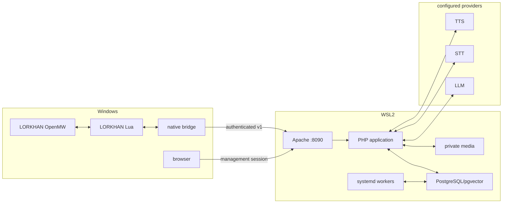
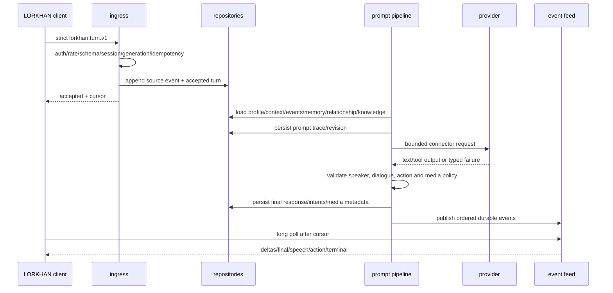

# Reference server setup and data flow

Research date: 2026-07-18

The sibling `LORKHAN/docs/REFERENCE-STACK-DATAFLOW.md` describes the full game/client/server flow.
This document concentrates on what the final Synthserver contributes and how its Fallout semantics
become an OpenMW/TES3 backend.

## Product roles

| Product | Owns | Does not own |
| --- | --- | --- |
| OpenMW | Game world, objects, saves, audio/rendering and sandboxed Lua runtime | AI profiles/providers/memory. |
| LORKHAN native bridge | Authenticated typed loopback transport/media and cancellation | Prompts, arbitrary HTTP, engine actions. |
| LORKHAN Lua | Player input/UI, current world context, actor identity and typed action execution | Provider keys/database/long-term memory. |
| LorkhanServer | Events, prompts/providers, profiles, memory, relationships, knowledge, media, management/workers | Direct game mutation or assumed action success. |
| Optional content addon | Original records/assets only after separate gate | Core transport/server/product logic. |

## Physical flow

## First-run setup

1. Install/verify WSL stack and immutable LorkhanServer release.
2. Create least-privilege database roles, migrate and seed safe defaults/mock providers.
3. Start supervised workers and verify heartbeat.
4. Bind Apache port 8090 in WSL and prove Windows reachability through the launcher's loopback port 7514.
5. Generate pairing token and import native profile snippet.
6. In browser Quickstart, choose mock or configured providers, create/bind profile/playthrough and
   enable desired action tiers.
7. Start LORKHAN. Session init supplies exact engine/API/client/content/capability identity.
8. UI shows compatibility, DB/migrations, workers, provider and client status before claiming ready.

## Session initialization

Native code authenticates and sends `lorkhan.session.init.v1`. Ingress validates runtime pin/API,
client/protocol, content fingerprint, profile/playthrough request and caps. Application derives the
installation's allowed binding and action/prompt/provider settings, persists a session/init source
event, closes the prior current generation, and returns intersection capabilities plus config revision
and event cursor.

Lua receives only safe configuration/capabilities through native results. Pair token, DB/provider
secrets and browser session never enter Lua.

## Turn pipeline

No external provider call is inside a DB transaction. Source input remains even if provider fails.
Per-playthrough serialization plus request state/idempotency prevents colliding narrative turns; a
single global process lock is not the correctness model.

## Prompt assembly

Load under token/row/age budgets:

- selected base/dynamic character profile and prompt/action revision;
- exact input, target/speaker/audience and bounded current OpenMW snapshot/delta;
- recent source events/utterances and unresolved terminal results;
- relationship state and source-derived memories/summaries;
- relevant world knowledge with retrieval source IDs;
- narrator, diary, or playback-gated rechat instruction only when that explicit player-originated
  flow is active; no timer-autonomy instruction is accepted;
- capability-filtered allowed actions and output schema.

Persist source IDs, ordering, truncation, model/provider/config revision, durations and a redacted
prompt trace. Do not store or expose secret headers. A model response is untrusted: prose is bounded,
speaker must resolve, and tool/action JSON must match a known enabled schema.

## Dialogue, speech and delivery

Text deltas are optional UI progress and not memory sources. Final validated utterance is persisted,
then an ordered `dialogue.complete` event is visible and a durable per-utterance TTS job is queued. TTS generates/stores private bytes and metadata independently;
the speech event contains the originating dialogue message ID plus opaque media ID/hash/size/codec/expiry. Client verifies, queues, plays or reports delivery
failure. Media expiry does not erase source utterance/provenance.

Groups have explicit audience and one speaker/addressee per utterance. The server may select a
speaker only among current eligible identities; client remains authoritative about live activity and
returns failure rather than substituting an actor.

## Action-result loop

1. Provider output proposes a typed catalog action.
2. Server checks enabled tier/capability/schema/actor/target/limits/expiry and persists intent.
3. Event feed emits it; client revalidates current game state and attempts it on game thread.
4. Client posts exactly one terminal result. Server idempotently persists it as a source event.
5. At most one result-aware follow-up per action is queued, within four actions/originating turn.

Server UI distinguishes proposed, rejected, emitted, delivered and terminal status. Timeout, halt,
stale generation and client rejection are first-class results. The server never calls emission
success.

## Persistent intelligence and jobs

Post-turn jobs derive memory, embeddings, summaries, relationships, dynamic profiles, diary and
playthrough state from committed source IDs. Jobs have schema/idempotency key, lease/heartbeat,
attempt/next run, stable failure code and dead-letter state. Rerun produces the same logical result or
a new explicit revision; it never duplicates invisible state.

Memory/knowledge retrieval records selected source IDs/scores/model/dimension/revision. Users can
inspect/edit/delete/rebuild derived data without rewriting immutable source events. Retention and
playthrough deletion are explicit and auditable.

## Management UI

- Quickstart and health: DB/migrations, pairing fingerprint/rotation, client pin/caps/content, provider
  tests, workers/media/backup.
- Configuration: profiles, prompts, actions/tiers, providers, narrator/diary/rechat and retention;
  excluded autonomy controls remain disabled presentation landmarks only.
- Inspection: source events, turns, prompt/provider attempts, utterances, speech, action/results,
  actors/content manifests, memories, relationships, knowledge and playthroughs.
- Operations: jobs/dead letters/replay, diagnostics bundle, backups/restore, schema/release version,
  import/export/delete and audit.

Writes require browser session/CSRF/validation/audit/confirmation where destructive. Stored secrets
remain masked and are never re-rendered.

## Migration checkpoints

1. Final Synthserver source/provenance inventory and green import baseline.
2. Product/semantic/schema conversion with forbidden-term audit.
3. Clean DB, pairing, health, mock provider and loopback deployment.
4. Strict session/source-event persistence and sibling contract parity.
5. Complete mock turn/event/media/delivery path.
6. One inspect action and terminal result path.
7. Profiles/memory/relationship/knowledge/narrative workers.
8. Complete management/backup/diagnostics and security hardening.
9. Clean WSL E2E, source/license/secret scan and all automated ledger rows.
10. Later exact Windows LORKHAN in-game matrix.

## Source navigation after the start gate

In the final Synthserver, inspect entry routing/bootstrap, request/response/schema validation,
repositories/migrations, connector registry/LLM/STT/TTS, media storage/serving, turn/prompt/action
pipeline, event cursor/streaming, background processors/jobs, relationship/memory/world knowledge,
Quickstart/UI routes and tests. Record exact paths and SHAs in the evidence map because they may differ
from today's planning layout.

Use pinned DialecticServer/HerikaServer paths only to explain lineage or detect a missed outcome. Do
not overlay older source onto the completed Synthserver.
